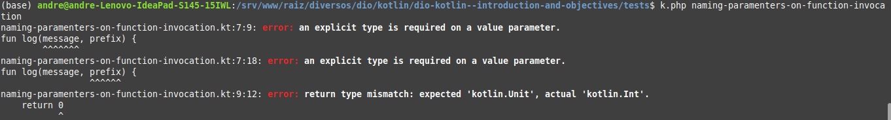

# Introuction

As you can see in my [version of Jankenpo in Kotlin](https://github.com/andreterceiro/jankenpo-kotlin), I generate the **.jar**  file based on **.kt** file in 1 step and execute this **.jar** file in another step. Then I created this PHP script to make the process more easy:

```php
#!/usr/bin/php
<?php
exec("kotlinc -include-runtime ${argv[1]}.kt -d ${argv[1]}.jar");
echo exec("java -jar ${argv[1]}.jar") . "\n";
```

I named this script as **k.php** and gave a `chmod +x` on it. as you can see in the previous script, you don't need to provide the extension **.kt** to use it. as it have a shebang in the first line, you can execute it to see the output of index.kt (example) this way:

```
k.php index
```

Observation: the directory of this script is on the PATH environment variable of my system.


## Tests

I will create some files related who is teached in the videos in the "tests" directory.


## Comments about the tests and the videos

- The functions **print()** and **println()** are available.
- You can define a package without relation with the directory structure. In the next example, the directory of the file is "tests":
```Kotlin
package banana

fun main() {
    print("Hello world")
}
```

In Kotlin you can specify the return of a function, do not specify, and when specify, you can define that the return is "Unit" (whatever). If you do not define, is the same as define as "Unit". Please see the examples in the directory "tests".

You can specify a default value of a function parameter this way (example):
```kotlin
package tests

fun p(message: String, level: String = "info") {
    print("[$level] $message");
}
```

In the previous example you can see also how to interpolate varibles and strings.

Kotlin also have inline functions, see:

```kotlin
package tests

fun main() {
    print(multiply(2, 3))
}

fun multiply(a: Int, b: Int): Int = a * b
```

As you could saw in the above line, it was not necessary to specify the return. The function hasn't the keyword "return". The return is implicit.

You can specify the name of the parameters in the invocation of the function, as you do in Python, see mainly the invocation of the function log() (log(message = "Mensagem de log", prefix = "Info")):

```kotlin
package tests

fun main() {
    log(message = "Mensagem de log", prefix = "Info")
}

fun log(message: String, prefix: String) {
    println("[$prefix]: $message")
}
```

Now see this similar code:

```
package tests

fun main() {
    log(message = "Mensagem de log", prefix = "Info")
}

fun log(message, prefix) {
    println("[$prefix]: $message")
    return 0
}
```

if you try to generate the jar file with `kotlinc`, these errors will occur:



See, the errors are related of the types are not specified. Both of the parameters as the return type. But didn't tell me that I can omit the return type, right? Yes, right, but if you do not return anything kkkk.


## varargs

In my machine I have this version of Kotlinc (I got the version using the command `kotlinc -v`):

```
info: kotlinc-jvm 2.1.0 (JRE 21.0.4+7-Ubuntu-1ubuntu220.04)
```

 And the code related to this section didn't work as I expected. So I executed the code in Kotlin Playground, please see [this link](https://pl.kotl.in/0ZuDvkzKg)

You can play the code there.

This is the code:

```kotlin
/**
 * You can edit, run, and share this code.
 * play.kotlinlang.org
 */
package tests

fun main() {
    printAll("hi", "José", "da Silva")
}

fun printAll(vararg messages: String) {
    for (message in messages) {
        println(message)
    }
}
```

See the **varag** in the printAll function and the invocation of this function that have 2 paramenters with only 1 paarmenter. Why? Because **vararg** in the parameter. Messages now is an array of strings.

But pay atention, this next code will not work:

```kotlin
package tests

fun main() {
    printAll(["hi", "José", "da Silva"])
}

fun printAll(vararg messages: String) {
    for (message in messages) {
        println(message)
    }
}
```

The difference between the two previous codes is how you call printAll function. In the first, you pass several Strings and it works because of **varagr**. In the second you are passing an array of strings. Are different things. And if a vararg after the call of the function (even in the first code) is transformed in an array even if I passed several strings (and not an array) in the call of the function, how to pass a parameter received as vararg (an array inside the function) to another function that also receives a vararg? Usind the <b>*</b> operator, [see](https://pl.kotl.in/bwDb2BDeN):
```kotlin
package tests

fun main() {
    prepare("hi", "José", "da Silva")
}

fun printAll(vararg messages: String) {
    for (message in messages) {
        println(message)
    }
}

fun prepare(vararg messages: String) {
    printAll(*messages)
}
```


## functions inside function

See this code:

```kotlin
package tests

fun main() {
    fun p1(message: String) {
        print(message)

        fun p2(message: String) {
            println(message)
        }
        p2(" <<<<<<<<<<<<<<<<<<")
    }
    p1("Hello, World!")
}
```

This code works, but keep in mind that is not possible to call p2("message") outside p1(message) function.


## var and val

Var is **mutable** and val is **immutable**. If you try to change a val variable, you will get an error.

You can't print and val or var that wasn't initialized. This next code will trhouw an error:

```kotlin
package tests

fun main() {
    var a
    print(a)
}
```

Another question: Kotlin can infer the type of a variable, so you don't need to specify it. In the next code, the variable "a" is a string:

```kotlin
package tests

fun main() {
    var a = "test"
    print(a)
}
```

But you can specify the type if you want:

```kotlin
package tests

fun main() {
    var a:String = "test"
    print(a)
}
```

The last comment is related to **"val"**. You can't change a val. The next code will throw an error:
```kotlin
package tests

fun main() {
    val a = "test 1"
    a = "test 2"
    print(a)
}
```

But if you do not initialize the val, you can set a value. The next code will work:

```kotlin
package tests

fun main() {
    val a: String
    a = "test 2"
    print(a)
}
```

But only works because we seeted the type, the type was not infered by Kotlin. How to infer if we do not have a value? = error.


## Dealing with nulls

By default, if you set an initial value of a variable (**var**, or to a **val** also), you cannot set the value `null` to it, see:

```kotlin
package tests

fun main() {
    var a:String = "banana"
    print(a)
    a = null // <= Error if you try to assign null to a non-nullable variable
}
```

But you can set a value to `null` if you declare the variable as nullable, like this:

```kotlin
package tests

fun main() {
    var a:String? = "banana"
    print(a)
    a = null
}```

The difference occurs in the question mark after the type in the variable declaration.

To enforce, this characteristics does no depends if you set the type of the variable or not, see:

```kotlin
package tests

fun main() {
    var a = "banana"
    print(a)
    a = null // <= Error if you try to assign null to a non-nullable variable
}
```

In this example we used inference to define the type of the variable "a", but the error still occur.